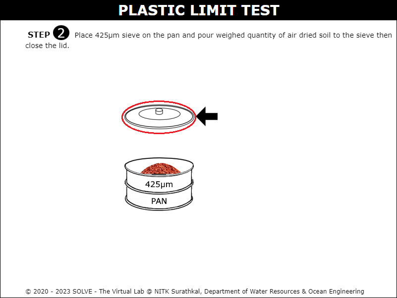

#### The following procedure steps will be followed on the Liquid Limit test simulator

1.	Click on the liquid limit icon to open the liquid limit test simulation. Click on the description icon to see a brief information about the experiment. 
  
 

2.	Click on the soil sample to measure 120 grams of soil and then click on the next button.  
 

3.	Click on the soil sample to pour it into the sieves and place it inside the sieve shaker and sieve for 10 mins. Then click on the next button. 
 

4.	Remove the sieves from the sieve shaker and collect the sample retained on the 425 micron sieve. 
 

5.	Answer the formative questions that have popped up to move forward in the simulation. 
 

6.	Create a smooth paste by mixing the soil sample and distilled water together. 
 

7.	Spread the prepared sample on the casagrande apparatus cup creating a uniform layer throughout. 
 

8.	Click on the grooving tool to create a separation line at the center of the cup and click on the next button. 
 

9.	Click on the crank to lift and drop the cup until the two parts join at any portion inside the cup and click on the next button. 
 

10.	Click on the empty container to measure its empty weight and click on the next button. 
 

11.	Add some portion of soil sample into the container and again measure its weight and click on the next button. 
 

12.	Place this container inside the heating oven and then measure its weight after 24 hours of drying. 
 

13.	Based on the values obtained, determine the water content for the soil sample. 
 

14.	Similarly repeat the same procedure for two more trials and determine average water content. 
 

15.	 Determine the remaining values based on the values and graphs obtained.  
    

#### The following procedure steps will be followed on the Plastic Limit test simulator

1.	Click on the liquid limit icon to open the liquid limit test simulation. Click on the description icon to see a brief information about the experiment. 
 
 

2.	Measure 20 grams of air dried soil in the evaporating dish and then click on the next button. 
 

3. Pour the measured amount of soil into the sieve set and click on the sieve lid to close the sieve set and click on the next button. 
 

4. Place the sieve set in the sieve shaker and on the machine for 10 mins, then click on the next button. 
 

5. Click on the sieve to collect the soil retained on the 425 micron sieve. Answer the formative questions that come up in the simulation to move forward in the simulation. 
 

6. Prepare a plastic mixture of the soil sample by mixing it with the required amount of water. 
 

7. Click on the hands to create small balls from the prepared soil sample. 
 

8. Click on the hand to form uniform 3mm width threads from the soil balls and then click on the next button. 
  
 

9. Click on the empty cylinder and measure its empty weight. 
 

10. Add some soil samples into the container and again measure its weight. 
 

11. Click on the container with a soil sample to place it inside the heating oven for 24 hours. 
 

12. Click on the container with dry soil and measure its weight and then click on the next button. 
 

13. Based on the values obtained, calculate the water content for the soil sample. Similarly repeat the same procedure for two more trials and calculate the required parameters. 
  
    
